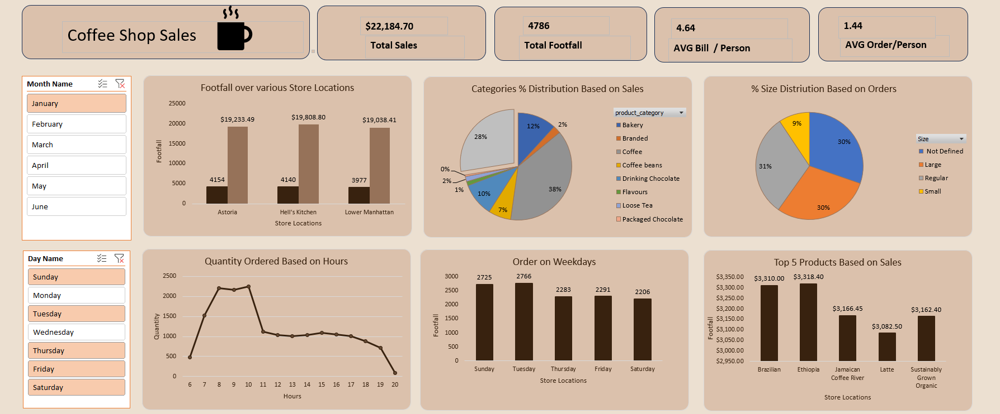

# ☕ Coffee Shop Sales Dashboard

An interactive **Power BI Dashboard** built to analyze coffee shop sales performance across multiple store locations. This dashboard provides insights into sales, customer footfall, product performance, order trends, and customer purchasing behavior, enabling data-driven business decisions.

---

## 📊 Dashboard Preview

> Add your dashboard screenshot here.



---

## 🚀 Features

- 📈 Total Sales Overview
- 👥 Customer Footfall Analysis
- 💵 Average Bill per Customer
- 🛒 Average Orders per Customer
- 🏪 Store Location Performance
- 🥧 Product Category Sales Distribution
- 📦 Order Size Distribution
- ⏰ Hourly Order Quantity Analysis
- 📅 Weekday Sales Performance
- ⭐ Top 5 Best-Selling Products
- 🎯 Interactive Filters
  - Month
  - Day of Week

---

## 📌 Key KPIs

| KPI | Value |
|------|-------|
| Total Sales | $22,184.70 |
| Total Footfall | 4,786 |
| Average Bill / Person | 4.64 |
| Average Orders / Person | 1.44 |

---

## 📈 Dashboard Insights

### Store Performance
- Compares sales and customer footfall across:
  - Astoria
  - Hell's Kitchen
  - Lower Manhattan

### Product Category Analysis
Visualizes the percentage contribution of each product category, including:
- Coffee
- Bakery
- Tea
- Coffee Beans
- Drinking Chocolate
- Branded Products
- Loose Tea
- Packaged Chocolate
- Flavours

### Order Size Distribution
Shows customer ordering behavior by:
- Small
- Regular
- Large
- Not Defined

### Hourly Sales Trend
Analyzes customer ordering patterns throughout the day to identify peak business hours.

### Weekday Analysis
Displays customer footfall by weekday for identifying the busiest days.

### Top Products
Highlights the highest revenue-generating products.

---

## 🛠 Tools & Technologies

- **Power BI Desktop**
- Power Query
- DAX (Data Analysis Expressions)
- Data Modeling
- Interactive Visualizations

---

## 📂 Project Structure

```
Coffee-Shop-Sales-Dashboard/
│
├── Coffee Shop Sales Dashboard.pbix
├── Dataset/
│   └── Coffee Shop Sales.csv
├── Images/
│   └── dashboard.png
├── README.md
└── LICENSE
```

---

## 📊 Dashboard Components

- KPI Cards
- Clustered Column Charts
- Pie Charts
- Line Charts
- Slicers
- Interactive Filters

---

## 📌 Business Questions Answered

- Which store generates the highest revenue?
- Which product category contributes the most to sales?
- What are the busiest hours of the day?
- Which weekdays have the highest customer footfall?
- What are the top-selling products?
- How do customers prefer their order sizes?

---

## 🎯 Skills Demonstrated

- Data Cleaning
- Data Transformation
- Data Modeling
- DAX Measures
- Business Intelligence
- Data Visualization
- Dashboard Design
- KPI Development
- Interactive Reporting

---

## 👤 Author

**Your Name**

- GitHub: https://github.com/Divyanshu-Singh-Bisht

---

## ⭐ If you found this project useful

Give this repository a ⭐ on GitHub and feel free to fork it for learning or further development.

